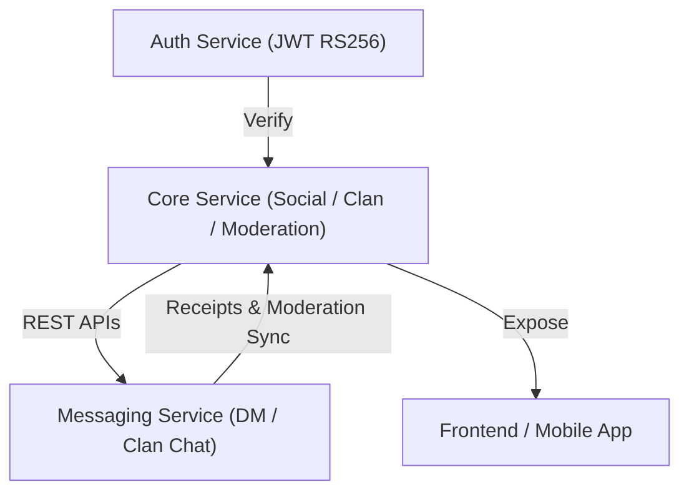

# 🧩 BrainBattle Clan – Backend Monorepo

> Unified backend monorepo for the **BrainBattle platform**, integrating the social (core) and messaging (WS) services.  
> Designed for scalability, service isolation, and seamless developer experience.

---

## 🏗️ Overview

`brainbattle-clan` consolidates the backend logic for the BrainBattle ecosystem:

| Service | Scope | Port | Stack |
|----------|--------|--------|--------|
| ⚙️ **Core Service** | Social Graph · Clan Management · Moderation | `3001` | NestJS + Prisma + PostgreSQL |
| 💬 **Messaging Service** | 1v1 & Clan Chat · WebSocket · Receipts | `3002` | NestJS + Prisma + Redis |

Both services share a consistent architecture — NestJS, Prisma ORM, RS256 token verification — and communicate through **authenticated REST** and **real-time WS channels**.

---

## 📁 Monorepo Structure
brainbattle-clan/
├── brainbattle-core/ # Core microservice
├── brainbattle-messaging/ # Messaging microservice
├── .gitignore
├── LICENSE
└── README.md

---

## ⚙️ Development Workflow

### 1️⃣ Clone the monorepo
```bash
git clone https://github.com/brainbattle-platform/brainbattle-clan.git
cd brainbattle-clan
```
### 2️⃣ Setup environments

Each subservice maintains its own .env configuration and database.
Ensure both coredb and msgdb PostgreSQL containers are running.
```bash
# From root folder
cd brainbattle-core
npm install
npx prisma generate

cd ../brainbattle-messaging
npm install
npx prisma generate
```
### 2️⃣ Setup environments
```bash
# Core Service (REST)
cd brainbattle-core
npm run start:dev

# Messaging Service (WebSocket + REST)
cd ../brainbattle-messaging
npm run start:dev
```
Both services will verify JWTs issued by brainbattle-auth and connect to independent databases.

---

## 🔗 Integration Diagram


---

---

## 🧪 Testing Flow
You can test both services together using Postman collections included in each module.
A typical full flow involves:
  1. Obtain access token from brainbattle-auth
  2. Create clan & follow users via Core Service
  3. Initiate DM thread through Messaging Service
  4. Exchange messages → observe real-time WS delivery
  5. Mark read / receipts updates
  6. Check moderation reports for content or users

💡 Each service can also be tested independently using the same tokens and databases.

---

## 🚀 Deployment Notes
Each microservice uses its own PostgreSQL + Redis instance.
JWT public key must match that of brainbattle-auth.
Socket.IO Redis adapter enables horizontal scaling (multi-instance).
All timestamps are in UTC.

---

## 🧰 Tooling & Dev Notes

* Unified NestJS + Prisma conventions across all services
* Shared schema principles (DMThread, Clan, UserRelation)
* Follows clean microservice pattern: isolation + authentication boundary
* Ready for Dockerized orchestration and future gRPC or message bus integration

---

## 🧭 Roadmap

* Add brainbattle-notification service (push/email)
* Inter-service event queue (Kafka / NATS)
* Unified user moderation dashboard
* CI/CD workflow for service deployment

---

> © 2025 BrainBattle Platform – Clan Monorepo (Core + Messaging)
> Maintained by BrainBattle Core Infrastructure TeamInfrastructure Team.
